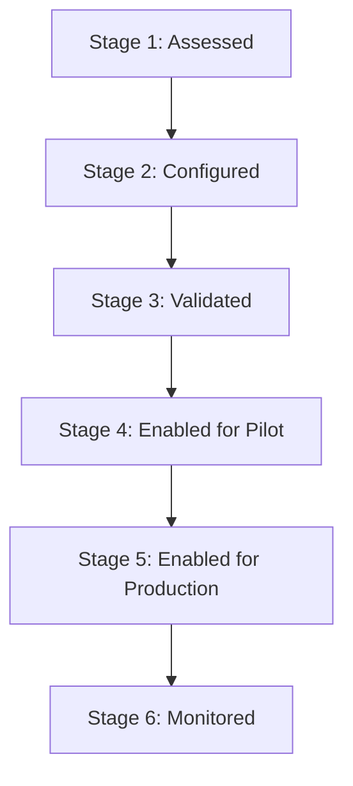

# Plant Onboarding & Certification Runbook

This runbook outlines the operational process to onboard a new plant, warehouse, and related configurations into the IOReporting pipelines, as well as the procedures for certifying, overriding, or blocking data products.

---

## 0. Stage-gate enforcement (Bronze → Silver) — read first

IOReporting enforces a **plant/site stage gate** between Bronze and Silver (canonical contract:
[`source-contracts/site_stage_gate_contract.md`](../source-contracts/site_stage_gate_contract.md)):

- **Bronze is raw and unfiltered** — every plant is replicated.
- **Silver is stage-gated** — operational Bronze → Silver flows are scoped to the plants/warehouses in
  the governed gate (`site_config_plant` + `site_config_warehouse`) **before** entering Silver. A plant
  not in the gate does not appear in Silver, repo-wide (not only Warehouse360).
- **Gold and serving views inherit Silver scope** — they do not re-open the gate.
- **Secured / serving views handle user access, NOT onboarding inclusion** — row-level security and the
  plant gate are independent; security never substitutes for the stage gate.
- **A new plant must pass the stage gate before inclusion.** Onboarding = activating it in the gate
  config (below). No transformation-code change, no hard-coded plant lists.
- **DEV is a technical shakedown** — currently one onboarded plant, `C061` (warehouse `208`); DEV bronze
  is multi-plant, so the gate is a real filter. **UAT is the first full business validation.**

Enforcement rolls out in phases (see the contract + `source-contracts/silver_stage_gate_inventory.yml`,
which classifies every Silver output ENFORCED / EXEMPT / BLOCKED / NEEDS_MAPPING). Phase 1 enforces the
WM/MM reference flows; the inventory tracks the rest. The CI guard
`scripts/ci/check_silver_stage_gate_coverage.py` fails if any Silver output is unclassified.

---

## 1. The Rollout Lifecycle

Plants onboard through a six-stage lifecycle:



1. **Stage 1 — Assessed:** A site's module usage (WM, PP, QM) is mapped. Initial transactional data volume is checked.
2. **Stage 2 — Configured:** Required config tables are seeded in UC.
3. **Stage 3 — Validated:** Automated checks run and validation scores/failures are computed.
4. **Stage 4 — Enabled for Pilot:** The plant is approved for pilot consumption (e.g. pilot dashboards).
5. **Stage 5 — Enabled for Production:** The plant is promoted to standard production dashboard consumers.
6. **Stage 6 — Monitored:** Continuous check of freshness, coverage, and validation.

---

## 2. Onboarding Steps (Stage 2 Setup)

To onboard a site, configuration must be added to the following tables in the Unity Catalog `silver` schema:

### Step 2.1: Register the Plant (`site_config_plant`)
Add a row representing the plant.
* Required Fields: `plant_code`, `plant_name`, `country`, `region`, `go_live_status` (set to `PILOT` or `PRODUCTION`), `wm_enabled_flag`, `hu_enabled_flag`, `qm_enabled_flag`, `batch_managed_flag`, `process_manufacturing_flag`.

### Step 2.2: Register the Warehouse (`site_config_warehouse`)
If the plant uses WM, map the plant-to-warehouse relationship.
* Required Fields: `plant_code`, `warehouse_number`, `relationship_type` (`PRIMARY` or `SHARED`), `wm_usage_type` (`FULL_WM` or `PARTIAL_WM`), `is_active` (`true`).

### Step 2.3: Map Storage Type Roles (`site_config_storage_type_role`)
Each storage type within the warehouse must be mapped to its role.
* Required Fields: `plant_code`, `warehouse_number`, `storage_type`, `storage_role` (`LINESIDE`, `STAGING`, `INTERIM`, `BULK`, `DISPENSARY`, `QUARANTINE`, `PICK_FACE`, `RECEIVING`, `SHIPPING`), `role_confidence` (`CONFIRMED`), `include_in_lineside_stock`.

### Step 2.4: Classify Site-Specific Movement Types (`site_config_movement_type_classification`)
Ensure all `Z*` or custom movement types used by the plant are classified.
* Required Fields: `plant_code` (can be null for global default, or site-specific), `movement_type_code`, `event_category`, `is_production_receipt`, `is_production_consumption`, `is_scrap`, `is_reversal`.

### Step 2.5: Configure Staging Methods (`site_config_staging_method`)
For PP supply areas, map the staging methods.
* Required Fields: `plant_code`, `warehouse_number`, `production_supply_area`, `storage_type`, `staging_method` (`ORDER_SPECIFIC`, `CONSOLIDATED`, `BULK_DROP`), `sap_reference_pattern` (`TO_BENUM_EQUALS_AUFNR`).

---

## 3. Validation Scoring & Certification (Stage 3 & 4)

Once config is loaded, DLT pipelines automatically validate the configurations against active data over the last 90 days.

### Scoring Deductions
* **Critical Validation / Freshness Failure:** -40 points
* **High Validation Failure:** -20 points
* **Medium Validation Failure:** -10 points
* **Low Validation Failure:** -3 points
* **Missing Config:** -30 points
* **Maturity / Security Issue:** -20 to -50 points

### Status Mapping
* **90–100:** `READY` (Eligible for Production)
* **75–89:** `READY_WITH_WARNINGS` (Eligible for Production with Caveats)
* **50–74:** `PILOT_ONLY` (Eligible for Pilot Only)
* **0–49:** `BLOCKED` (Restricted from all dashboards)

---

## 4. Manual Enablement & Overrides

Data Owners can manually override computed status using `site_config_kpi_enablement`:

1. **Force Block / Pilot:** If a KPI has passed automated checks but the business wants to hold rollout, add a row in `site_config_kpi_enablement`:
   ```sql
   INSERT INTO site_config_kpi_enablement (plant_code, data_product_name, kpi_name, enablement_status, reason_code, approved_by, approved_at)
   VALUES ('C061', 'gold_lineside_stock', 'Lineside Stock', 'PILOT_ONLY', 'MANUAL_HOLD', 'data_owner_id', CURRENT_DATE());
   ```
2. **Override Constraints:**
   * An automated `BLOCKED` status due to a critical validation failure **cannot** be overridden to `READY`. The underlying data or configuration gap must be closed.
   * `Directional only` or `Compatibility only` base tables cannot be overridden to `READY` or `READY_WITH_WARNINGS`.

---

## 5. Handling Failures and Downgrades

If an active plant's validation score drops:
1. **Freshness Lag > 24 hours:** The status of all data products automatically drops to `BLOCKED`. Runbook action: Check Bronze replication jobs and restore freshness.
2. **Unmapped Storage Types with Stock:** The storage type role coverage check will trigger a failure. Runbook action: Check `gold_validation_failure_detail` and map the storage type in `site_config_storage_type_role`.
3. **Unclassified `Z*` Movement Types:** Active movement types with no classification will automatically set the validation status to `BLOCKED` for production KPIs. Runbook action: Add movement type classifications.
