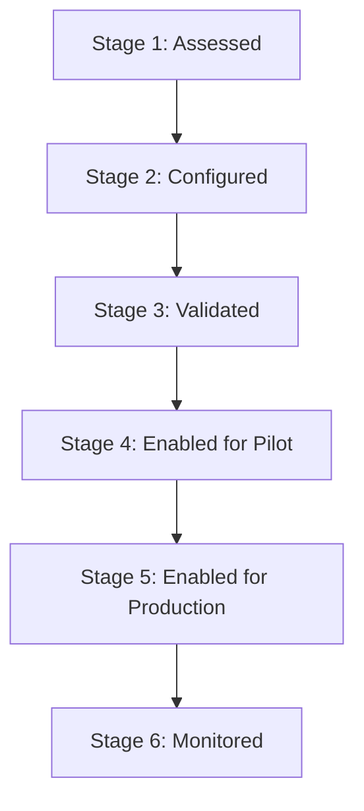

# Plant Readiness Model

This document defines the readiness scoring, gates, severity levels, and rollout process for the IOReporting data product.

## 1. Readiness Statuses

The readiness status of any plant/domain/KPI combination is categorized as follows:

| Status | Meaning | Can be used in production dashboards? |
|---|---|---|
| `READY` | Validation passed, configuration complete, freshness acceptable. | Yes |
| `READY_WITH_WARNINGS` | Usable, but known non-critical caveats or minor anomalies exist. | Yes, with visible caveat |
| `PILOT_ONLY` | Logic is useful but not yet validated enough for production decisions. | Limited pilot dashboards only |
| `BLOCKED` | Must not be used for this plant/domain (high risk of data inaccuracy). | No |
| `NOT_APPLICABLE` | Plant does not use the relevant process or SAP module. | No (not an error) |
| `UNKNOWN` | Not assessed yet. | No |

---

## 2. Severity Levels for Validation Failures

When a validation rule fails, it is assigned a severity that impacts the overall score:

| Severity | Meaning | Example | Deduction |
|---|---|---|---|
| `CRITICAL` | KPI could be materially wrong or misleading. | Active movement types are unclassified. | -40 |
| `HIGH` | KPI is usable only with severe caution. | Storage type roles are incomplete. | -20 |
| `MEDIUM` | Some records are missing context. | Process-line enrichment below threshold. | -10 |
| `LOW` | Minor caveat or cosmetic gap. | Missing text descriptions. | -3 |
| `INFO` | Informational only (no material impact). | Plant does not use handling units. | 0 |

---

## 3. Scoring Model

Scoring is calculated per plant, domain, and data product starting at **100** points and applying deductions for configuration, freshness, or validation issues.

### Score Deduction Rules

| Category | Issue / Failure | Deduction |
|---|---|---|
| **Security** | Security/serving-view configuration issue | -50 |
| **Freshness** | Critical dependency SLA freshness failure | -40 |
| **Configuration** | Missing required configuration | -30 |
| **Maturity** | Sourced from a "Directional only" or "Compatibility only" object | -20 |
| **Validation** | Critical failure | -40 |
| **Validation** | High failure | -20 |
| **Validation** | Medium failure | -10 |
| **Validation** | Low failure | -3 |

### Score-to-Status Mapping

| Score | Computed Status |
|---|---|
| **90–100** | `READY` |
| **75–89** | `READY_WITH_WARNINGS` |
| **50–74** | `PILOT_ONLY` |
| **0–49** | `BLOCKED` |

### Override Rules

* **Critical Security:** Any critical security or grant check failure forces the status to `BLOCKED`.
* **Critical Freshness:** Any critical source freshness failure forces the status to `BLOCKED`.
* **Missing Config:** Missing mandatory plant or warehouse mapping config forces the status to `BLOCKED`.
* **Maturity Limit:** Existing repo label `Directional only` cannot be promoted above `PILOT_ONLY` without a formal redesign.
* **Compatibility Limit:** Existing repo label `Compatibility only` cannot be production-facing unless renamed or clearly caveated.

---

## 4. Rollout & Lifecycle Stages

Plants onboard through a staged lifecycle:

1. **Stage 1 — Assessed:** Plant data has been analyzed; validation gaps are identified.
2. **Stage 2 — Configured:** Required site config has been loaded.
3. **Stage 3 — Validated:** Automated checks run and validation scores are computed.
4. **Stage 4 — Enabled for Pilot:** Pilot dashboards/apps are authorized to consume data.
5. **Stage 5 — Enabled for Production:** Promoted to production dashboards/apps.
6. **Stage 6 — Monitored:** Continuous check of freshness, coverage, and validation.
