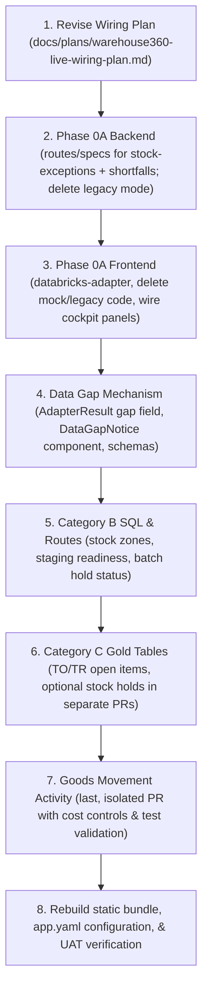

# Warehouse 360 — Live-Data Wiring Plan (Fulfill panels with governed data)

**Status:** approved for execution · **Owner:** warehouse-operations · **Date:** 2026-06-10
**Executor:** coding agent (this document is the work order — follow phases and sequencing in order)

## 1. Objective

This plan details the roadmap to wire the Warehouse 360 frontend (including its sibling staging and evidence workspaces in `domain-integrations/warehouse/`) **exclusively** to the governed data layer (`vw_consumption_warehouse360_*` views in `<catalog>.gold_io_reporting`, served via the FastAPI backend in `apps/api/`), and to retire all mock fixtures and legacy-API layers.

Consistent with the revised brief, **no Warehouse 360 or staging panel is removed solely because it lacks a first-wave governed source.** Instead, every panel must either consume governed live data, be reshaped to a truthful governed grain, or render a tracked `DataGapNotice`. 

This plan is **current-main aware**. The first-wave governed views already exist on `main` in both SQL definition and contracts; the executor must wire these existing assets rather than rebuilding them.

> [!IMPORTANT]
> Executing this plan is explicitly a **multi-PR program** across different repositories/layers (data product, backend API, and frontend packages). Landing this as a single monolithic PR is strictly forbidden. The sequence outlined in [Section 7: Execution Sequencing](#7-execution-sequencing) must be followed.

---

## 2. Hard constraints (do not violate)

1. **Sprint Gate for New Gold Scope.** New Gold scope is allowed only when the sprint gate is satisfied: replicated Silver dependency exists, grain documented in `gold/design_spec.md`, deterministic base MV (wall-clock only in `_live`; determinism CI guard stays green), unit tests, contract-manifest entry, Warehouse360 column-contract snapshot, security-generator registration (`GOLD_TABLES`), serving-view registration for date-relative columns (`SERVING_VIEWS`), regenerated SQL committed, and freshness/cost impact assessed.
2. **RLS chain stays intact.** All database reads must traverse the consumption views (which query `_live` / `_secured` views). Do not point FastAPI routes directly at gold tables or `_secured` views.
3. **No panel removal for missing sources.** No Warehouse360 or staging panel is removed solely because it lacks a first-wave governed source. Each panel must either consume governed live data, be reshaped to a truthful governed grain, or render a `DataGapNotice` naming the missing SAP source and tracking reference.
4. **Single-source consumption view rule.** Consumption views remain single-source projection/rename/filter layers (verified by `check_warehouse360_consumption_columns.py` which parses a single `FROM <src>`). Joins belong in Gold or serving views. No multi-source consumption SQL is permitted.
5. **Other domains untouched.** `trace2`, `poh`, `cq`, `spc`, and `envmon` adapters, routes, and legacy-API helpers remain out of scope. Do not delete shared code if other domains still import it.
6. **Green CI guards.** Keep every CI guard green: `check_warehouse360_adapter_contract_columns`, `check_warehouse360_consumption_columns`, `check_warehouse360_migration_static`, `check_contract_coverage`, `check_app_migration_registry_guard`, plus backend pytest and frontend vitest/lint suites.

---

## 3. Current state

### Backend (`apps/api`)
- `routes/warehouse360.py` exposes 5 governed routes: `GET /api/warehouse360/{overview,inbound,outbound,staging,exceptions}` plus a legacy proxy `POST /api/wh360/warehouse-summary`.
- `adapters/warehouse360/warehouse360_databricks_adapter.py` supports two modes: `governed_contracts` vs `legacy_wh360`. Deployed configurations run in `governed_contracts` mode.
- Two contracts already exist but have no FastAPI route or spec factory wired yet (`runtime_route_exists: false` in `warehouse360_view_expectations.yml`):
  - `warehouse360.stock_exceptions` → `vw_consumption_warehouse360_stock_exceptions`
  - `warehouse360.shortfalls` → `vw_consumption_warehouse360_shortfalls`
- `warehouse360.dispensary_queue` is draft/not deployed — ignore it.

### SQL & Contracts
- The consumption SQL views in `resources/sql/warehouse360_consumption_views_*.sql` and schemas in `contracts/warehouse360_consumption_column_contract.yml` already define the first-wave schemas for overview, inbound, outbound, staging, stock exceptions, shortfalls, and IM/WM reconciliation, with all approved exceptions resolved (empty).

---

## 4. Dataset & Panel Disposition Table

All panels and adapter methods are classified into four categories:
* **A**: Already governed on `main` — backend/frontend wiring only (no data-layer work).
* **B**: Existing Gold — new consumption view, contract snapshot, route, and frontend adapter.
* **C**: New Gold required — must satisfy the full sprint gate in its own separate PR(s).
* **D**: Data-gap notice — panel stays but renders a `DataGapNotice` pointing to missing SAP sources.

| Adapter method / panel | Category | Governed source | Disposition |
|---|---|---|---|
| `getWarehouseOverview` / Overview Panel | **A** | `warehouse360.overview` (route exists) | Wire frontend to existing API route. No data-layer changes. |
| `getWarehouseInbound` / Inbound Backlog | **A** | `warehouse360.inbound_backlog` (route exists) | Wire to `vw_consumption_warehouse360_inbound_backlog` (PO-line grain). Field-level gaps (deferred gr_qty, open_qty, delivery_date, qa_status, vendor_name) handled as empty/null. |
| `getWarehouseOutbound` / Outbound Backlog | **A** | `warehouse360.outbound_backlog` (route exists) | Wire to `gold_delivery_pick_status_live`. Carrier field is a data gap. |
| `getWarehouseStaging` / `getStagingOrders` / `getWarehouseStagingStatus` | **A** | `warehouse360.staging_workload` (route exists) | Wire to `gold_process_order_staging_live`. Components/tasks are deferred. |
| `getNearExpiryStock` / Near Expiry Panel | **A** | `warehouse360.stock_exceptions` (**New Route**) | Wire to `vw_consumption_warehouse360_stock_exceptions` (bucket-aggregate risk). |
| `getShortfalls` / `getMaterialShortagesForPlan` | **A** | `warehouse360.shortfalls` (**New Route**) | Wire to `vw_consumption_warehouse360_shortfalls` over existing `gold_transfer_requirement_material_backlog_secured` (not new work). |
| `getWarehouseExceptions` / `getWarehouseExceptionItems` (Reconciliation) | **A** | `warehouse360.im_wm_reconciliation` (route exists) | Wire to `vw_consumption_warehouse360_im_wm_reconciliation` (aggregated exceptions). |
| `getReplenishmentNeeds` / Replenishment Panel | **A** | `warehouse360.shortfalls` | Rewire to shortfalls dataset. Derives urgency in the adapter from `oldest_tr_creation_date`. Other fields are data gaps. |
| `getWarehouse360Summary` / Summary Panel | **A** | N/A | Rebuild entirely in the frontend using the overview KPIs (no dedicated route). Delete V1 proxy. |
| `getStockOverview` / `getLocationCapacities` / `zone-capacity-view` | **B** | `vw_consumption_warehouse360_stock_zones` (**New Route**) | Replaces the old stock overview / location capacity panels. Reads from existing `gold_bin_occupancy_secured` (wh×plant×storage_type×bin_type). Reshaped in the UI to storage-type grain. Zone = `storage_type`; `stockLines` → `occupied_bin_count`; `capacityPercent` → `occupancy_rate`; `holdPercent` → blocked-bin rate. Backs both Stock Overview and Location/Zone Capacity (staging variant filters to staging roles). |
| `hold-status` (Batch hold status / Evidence Panel) | **B** | `vw_consumption_warehouse360_batch_hold_status` (**New Route**) | Reads from existing `gold_stock_availability_secured`. Route: `GET /api/warehouse360/batch/{batchId}/hold-status`. `activeHolds[]` provenance is a data gap. |
| `getStagingReadiness` / Staging Readiness Panel | **B** | `vw_consumption_warehouse360_staging_readiness` (**New Route**) | Reads from existing `gold_process_order_staging_live` (fully/partially/not-staged counts from `staging_fraction` and risk from `risk_band`). Adapter composes `openShortfalls` and `pendingPickTasks` from the shortfalls and pick-task datasets (no multi-source SQL). |
| `getOpenHolds` / Open Holds Panel | **B / Decision Gate** | `vw_consumption_warehouse360_open_holds` | **Design Decision Gate**: If the Open Holds panel is credibly served by category-level quantities, use a consumption view over `gold_stock_availability_secured` (rows where `QI`/`blocked`/`restricted` > 0) and DO NOT build a new gold table. Only escalate to Category C (`gold_stock_holds`) if quant/bin-level hold rows with `GR-date` age are required (since the panel renders `ageHours`, which `gold_stock_availability` cannot supply). Document the outcome and rationale in the plan and design spec. |
| `alerts` / Staging Alerts | **B** | N/A | Synthesized inside the frontend adapter from other live datasets: `shortfalls` → shortfall, `exceptions` `OPEN_TO_AGED_24H` → overdue-pick, and blocked staging orders → blocked-order. |
| `picking-waves-view` / Picking Waves Panel | **D** | N/A | Renders `DataGapNotice` (missing LTAK/REFNR wave groupings from SAP). |
| `move-requests-view` / Move Requests Panel | **C** | `vw_consumption_warehouse360_move_requests` (**New Table + Route**) | Wire to new `gold_transfer_requirement_open_items`. |
| Staging pick tasks / `getOpenToItems` / TO open items | **C** | `vw_consumption_warehouse360_pick_tasks` (**New Table + Route**) | Wire to new `gold_transfer_order_open_items`. |
| `getGoodsMovements` / Goods Movements Feed | **C** | `vw_consumption_warehouse360_goods_movements` (**New Table + Route**) | Wire to new `gold_goods_movement_activity` (MSEG-line grain, largest cost/risk, requires strict UAT testing and cost controls). |
| `getWarehouse360Context` / `context` | **D** | N/A | Context panel renders local request/filter details only; server-side metadata is a data gap. |

---

## 5. Detailed Specifications

### Category C: New Gold Tables & Performance Controls
All new Gold tables added under Category C must satisfy the full sprint gate. They are defined alongside `gold/warehouse_flow_gold.py`.
- **`gold_stock_holds`** (Only if the Section 4 Decision Gate concludes quant/bin grain is required): Grain: `wh` × `plant` × `material` × `batch` × `quant` for Q/S/restricted categories, from silver `storage_bin` (+`batch_stock`); `goods_receipt_date` as age basis; `_live` view computes age. Hold provenance/`raisedBy` are gaps.
- **`gold_transfer_order_open_items`** (Staging Pick Tasks): Grain: `wh` × `TO` × `item` from silver `warehouse_transfer_order` (and header-delete anti-join): source/dest storage type and bin, requested/confirmed qty, status, created/confirmed datetime + user, material, batch, `BENUM`/`BETYP` order linkage, priority, and `delivery_number`. `_live` view adds age. Date filters must be applied at query time only, never in the MV.
- **`gold_transfer_requirement_open_items`** (Move Requests): Grain: `wh` × `TR` × `item` from silver `warehouse_transfer_requirement` (open items): from/to storage types, required/open qty, status, created datetime + user, queue, and priority. `_live` view adds age. Assignee is a gap.
- **`gold_goods_movement_activity`** (Movements Feed): Grain: `MSEG`-line grain from silver `goods_movement` + `movement_types` classification. This table carries a high performance and cost risk. 
  - **Mandatory Cost Controls**:
    - **Physical Clustering**: Must use `cluster_by=["plant_code", "posting_date"]` (documented in design spec).
    - **Enforced Route Date-Window**: The route must enforce a default `date_from = today - 1`.
    - **Hard Window Limit**: Reject queries requesting a window larger than a hard maximum of 31 days, and enforce `limit <= 500`.
    - **No Unbounded Queries**: Ensure no unbounded query paths exist in the FastAPI route, frontend adapter, or consumption views.
    - **UAT Validation**: Verify query performance and cost metrics under load in UAT before the frontend changes ship, recording results in the freshness/cost section of the design spec.
    - **Route Acceptance Tests**: Must assert that queries without a date window default to the previous day, windows > 31 days are rejected with a 400 Bad Request, and no combination of parameters triggers a table scan.

### Category D: Gap Mechanism & UI
The gap handling strategy ensures that missing SAP dependencies do not crash the app, but instead clearly display what is missing:
- **`DataGapNotice` UI Component**: Placed in `packages/evidence-panel-runtime/src/ui/` wrapping `EmptyState` (`packages/ui/src/components/manufacturing/empty-state.tsx`). It renders a title "Data gap" and a required description referencing the missing SAP source and tracking issue.
- **`AdapterResult` Extension**: Add an optional `gap` property to `AdapterResult` (in `packages/source-adapters/src/types.ts`):
  ```typescript
  gap?: {
    source: string; // e.g., "LAGP (MAXGW, ANZRE, LGBKT)"
    tracking: string; // e.g., "SAP-REPL-09"
  }
  ```
- **Execution Rule**: A `DataGapNotice` is considered a successful adapter result containing gap metadata. It must not trigger error-handling UI or repeat retries.
- **Frontend Schema Alignment**: Adjust Zod schemas in `packages/data-contracts` to reflect SAP reality (no invented enum values; gap fields removed or marked nullable).
- **Source Contract Documentation**: Document every gap in `source-contracts/sap/sap_unresolved_sources.yml` mapping the unresolved SAP tables/columns to the respective tracking issues.

---

## 6. Execution Phases

### Phase 0A — Wire Existing Governed Datasets (No Data-Layer Changes)
Phase 0A must be fully completed, tested, and validated before any new Gold work starts. Frontend wiring completeness is the primary prerequisite.
1. **Remove `legacy_wh360` mode** from `apps/api/adapters/warehouse360/warehouse360_databricks_adapter.py`. Delete the `_get_source_mode()` logic, environment checks, and V1 proxy endpoints (`POST /api/wh360/warehouse-summary`).
2. **Add FastAPI Routes and Spec Factories** for the two existing contracts:
   - `stock_exceptions` → `GET /api/warehouse360/stock-exceptions`
   - `shortfalls` → `GET /api/warehouse360/shortfalls`
3. **Pydantic Response Models**: Add explicit Pydantic response models inside the route module mapping to the contract shapes.
4. **Contract bookkeeping**: Set `runtime_route_exists: true` for both in `warehouse360_view_expectations.yml`.
5. **Create `adapters/warehouse-360-databricks-adapter.ts`**: Port fetch routines for the 5 cockpit datasets from the legacy adapter verbatim (credentials: 'include', snake_case to camelCase translation, source: 'databricks-api'). Wire `getNearExpiryStock` to the new stock-exceptions route. 
6. **Implement the `DataGapNotice` mechanism** in the frontend, extending `AdapterResult` and wrapping `EmptyState`.
7. **Rewire staging/warehouse adapters** to fetch staging and shortfalls routes; delete unused methods to expose compilation errors.
8. **Delete mock artifacts**: Remove `warehouse-360-legacy-api-adapter.ts`, `warehouse-360-adapter-factory.ts` (export singleton directly), mock data files, and unused panel files.
9. **UI Refactoring**: Update panels listed in Section 4 to consume live adapter results or render `DataGapNotice`.

### Phase 0B — New Gold Scope & Consumption Views
1. **Design Decision Gate**: Align on Open Holds panel grain. Choose category-level quantities from `gold_stock_availability_secured` (Category B path) or build `gold_stock_holds` (Category C path).
2. **Implement Category B Consumption Views**: Write `vw_consumption_warehouse360_stock_zones`, `vw_consumption_warehouse360_batch_hold_status`, and `vw_consumption_warehouse360_staging_readiness` in `resources/sql/warehouse360_consumption_views_*.sql`. Add routes, adapters, and UI updates.
3. **Build Category C Gold Tables** (TO open items, TR open items, optional stock holds): Implement definitions in `gold/warehouse_flow_gold.py`, register in `GOLD_TABLES`/`SERVING_VIEWS`, write tests, add SQL, and expose via routes/adapters.
4. **Build Goods Movement Activity Table** (Separate PR, last): Define `gold_goods_movement_activity` with physical clustering, implement query window validation in the FastAPI route, write tests, and document cost results.

### Phase 1–4 — API Routes, Frontend Integration, and Deployment
1. **Backend Integration**: Wire routes for 0B/0C datasets. Enforce cost limits on the movements route.
2. **Frontend Wiring**: Complete hooks, adapter methods, Zod schemas, and UI panels.
3. **Static Bundle Rebuild**: Run `npm run prepare:databricks` and verify that the compiled static bundle contains zero `"mock"` sources or adapters.
4. **Verification**: Run the full verification suite (pytest, vitest, static checks, UAT validation).

---

## 7. Execution Sequencing

To maintain repository stability and code quality, the work must be submitted in the following strict order of PRs. **Do not combine these steps into one PR.**



1. **PR 1**: Plan revision (`docs/plans/warehouse360-live-wiring-plan.md`).
2. **PR 2**: Phase 0A Backend (add FastAPI routes and spec factories for `stock-exceptions` and `shortfalls`; delete legacy mode in adapter).
3. **PR 3**: Phase 0A Frontend (create `adapters/warehouse-360-databricks-adapter.ts`, delete legacy/mock adapters, rewire cockpit overview, inbound, outbound, staging, exception items, near-expiry, shortfalls, replenishment, and summary).
4. **PR 4**: Data Gap Mechanism (implement `DataGapNotice` in frontend, adjust Zod schemas, and write `sap_unresolved_sources.yml`).
5. **PR 5**: Existing-Gold Consumption Views & Routes (Category B: stock zones, staging readiness, batch hold status).
6. **PR 6**: New Gold Tables (Category C: TO open items, TR open items, optional stock holds).
7. **PR 7**: Goods Movement Activity (Category C: new table with clustering, route-level window controls, and UAT verification metrics).
8. **PR 8**: Bundle rebuild (`npm run prepare:databricks`), update `app.yaml`, and final verification run.

---

## 8. Verification & Acceptance Criteria

Every PR must pass the local verification suite:
```bash
# Backend pytest
cd apps/api && python -m pytest tests/ -q

# Static CI Guards
python scripts/ci/check_warehouse360_adapter_contract_columns.py
python scripts/ci/check_warehouse360_consumption_columns.py
python scripts/ci/check_warehouse360_migration_static.py
python scripts/ci/check_contract_coverage.py
python scripts/ci/check_app_migration_registry_guard.py

# Frontend tests and typechecks
pnpm --filter @connectio/di-warehouse test
pnpm --filter @connectio/di-warehouse typecheck
pnpm --filter @connectio/di-warehouse lint
```

### Final Acceptance Criteria:
- **Zero Mock Imports**: No imports of `*-mock-data` remain in `domain-integrations/warehouse/src/`.
- **Single-Source SQL**: `check_warehouse360_consumption_columns.py` verifies all views remain single-source queries.
- **Truthful Panels**: Every panel renders live data or a `DataGapNotice` explaining the missing SAP source.
- **No Unbounded Queries**: The goods movement route successfully rejects date windows larger than 31 days.
- **Grain Uniqueness**: All new Gold tables are UAT-validated for grain uniqueness.
