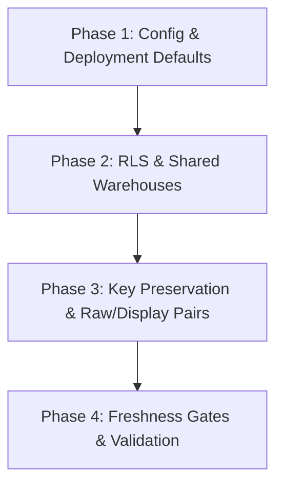

# Remediation Plan: Connected Plant Reporting Pipelines

This document outlines the actionable plan to resolve the remaining architectural, security, and performance issues identified in the **Burn-Everything Verdict** report.

---

## Plan Overview & Phases

### Phase 1: Config & Deployment Defaults (Immediate)
* **Goal:** Secure target configurations and eliminate production catalog defaults.
* **Actions:**
  1. Update `databricks.yml` variables to set default targets to dev/sample catalog and schemas instead of `connected_plant_prod`.
  2. Set target-specific email notifications and job schedule parameters.

### Phase 2: RLS & Shared Warehouses (High Priority)
* **Goal:** Secure and correct the plant security boundaries.
* **Actions:**
  1. Update [silver/tables/warehouse_reference.py](file:///home/timgeldard/github/rad/silver/tables/warehouse_reference.py) to resolve shared warehouses mapping dynamically:
     - Identify warehouses mapped to multiple plants.
     - Assign a special `'SHARED'` code (or resolve to `plant_code = 'SHARED'`) for empty bins in shared warehouses.
  2. Update the row filter generator [scripts/generate_row_filter_sql.py](file:///home/timgeldard/github/rad/scripts/generate_row_filter_sql.py) to:
     - Trim spaces when parsing the comma-separated `allowed_plants` attribute.
     - Permit access to records where `plant_code = 'SHARED'`.
  3. Re-generate environment SQL files under `resources/sql/`.

### Phase 3: Key Preservation & Raw/Display Columns (Medium Priority)
* **Goal:** Prevent destructive stripping of SAP keys.
* **Actions:**
  1. For key columns (e.g., `material_code`, `batch_number`, `order_number`), retain both the raw string format (with leading zeros) and the human-readable stripped version:
     - `material_code` (display) and `material_code_raw` (raw)
     - `batch_number` (display) and `batch_number_raw` (raw)
     - `order_number` (display) and `order_number_raw` (raw)
  2. Update references in:
     - `silver/tables/process_order.py`
     - `silver/tables/warehouse_fast.py`
     - `silver/tables/warehouse_reference.py`
     - `silver/tables/quality.py`

### Phase 4: Freshness Gates & Validation (Medium Priority)
* **Goal:** Ensure Gold aggregations fail if Silver fast streaming pipeline is stale.
* **Actions:**
  1. Add a validation table/view in `gold/dlt_gold_pipeline.py` that computes the max latency (`_replicated_at` vs `current_timestamp()`) on critical operational tables (e.g., `goods_movement`).
  2. Apply an expectation `@dlt.expect_or_fail` to fail the Gold pipeline run if freshness exceeds SLA (e.g., 2 hours).

---

## Execution Status

* [x] Priority 1: Remove Production Fallbacks (Completed)
* [x] Priority 1: Fix Delete Propagation CDC (Completed)
* [x] Priority 2: Enforce Freshness before Gold (Completed)
* [x] Priority 3: Redesign Security & Shared Warehouses (Completed)
* [x] Priority 4: Introduce Raw/Display SAP Key Pairs (Completed)
* [x] Priority 4: Re-align dangerous defaults in databricks.yml (Completed)
