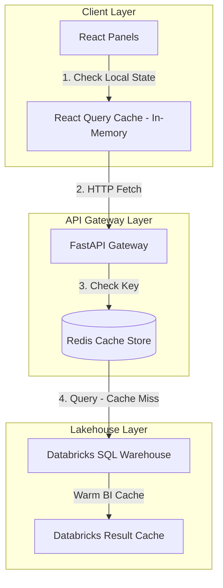

# Specification: API & Frontend Caching Optimization Layer

This document defines the architectural design, configuration specs, and code blueprints to implement the **API and Frontend Caching Layer**. 

This multi-layer optimization framework improves operations dashboard responsiveness, minimizes page load times, and cuts Databricks DBU consumption by implementing:
1. **FastAPI Redis Caching** for static lookup catalogs (plants, materials, movement types).
2. **TanStack React Query Deduplication** to prevent duplicate parallel API calls from client panels.
3. **High-Performance Serialization & Compression** (`orjson` and Gzip) for network payload efficiency.

---

## 1. The Problem Statement

Operations cockpits (like the *Planning Board* and *Lineside Monitor*) render multiple panels concurrently. Without a coordinated caching strategy:
* **Lookup Overhead**: Static parameters (e.g. lists of active plants, SAP material descriptions, movement code labels) are queried repeatedly from the Databricks SQL Warehouse, costing **800ms+** per query and bleeding DBU compute.
* **Socket & API Congestion**: Multiple frontend widgets request the same dataset simultaneously upon mounting, triggering redundant HTTP connections.
* **JSON Payload Bloat**: Serializing thousands of rows of warehouse records using standard Python `json` is CPU-heavy and generates large, uncompressed payloads that slow down UI rendering.

---

## 2. Multi-Layer Caching Architecture

We enforce a three-tier topology to catch requests as close to the user as possible:



---

## 3. Detailed Specifications

### A. FastAPI Redis Caching Integration ([cache.py](file:///home/timgeldard/github/connected-operations-intelligence/apps/api/shared/query_service/cache.py))

Extend the abstract `CacheStore` interface to implement a production-ready Redis backend:

```python
import redis.asyncio as redis
from typing import Any, Optional
from .cache import CacheStore, CacheEntry

class RedisCacheStore(CacheStore):
    """Redis-backed distributed cache store for cluster deployments."""

    def __init__(self, redis_url: str) -> None:
        self._redis = redis.from_url(redis_url)

    async def get(self, key: str) -> Optional[CacheEntry]:
        try:
            val = await self._redis.get(key)
            if not val:
                return None
            
            # Redis handles TTL expiration natively
            import pickle
            entry_data = pickle.loads(val)
            ttl = await self._redis.ttl(key)
            
            # Map back to standard CacheEntry tuple
            import time
            return CacheEntry(data=entry_data, cached_at=time.monotonic(), ttl=ttl)
        except Exception:
            # Fallback gracefully to prevent database failures from breaking the app
            return None

    async def set(self, key: str, data: Any, ttl: int) -> None:
        try:
            import pickle
            serialized = pickle.dumps(data)
            await self._redis.set(key, serialized, ex=ttl)
        except Exception:
            pass

    async def clear(self) -> None:
        try:
            await self._redis.flushdb()
        except Exception:
            pass
```

### B. Route Cache Decorator ([decorators.py](file:///home/timgeldard/github/connected-operations-intelligence/apps/api/core/decorators.py))

A custom FastAPI decorator to wrap static lookups (e.g. active plants) and cache their JSON responses:

```python
import functools
import json
from fastapi import Response
from shared.query_service.cache import get_cache_store

def cache_response(ttl_seconds: int):
    """Decorator to cache HTTP response payloads in the active CacheStore."""
    def decorator(func):
        @functools.wraps(func)
        async def wrapper(*args, **kwargs):
            # 1. Generate cache key based on function name and args
            cache_key = f"route:{func.__name__}:{str(args)}:{str(kwargs)}"
            cache = get_cache_store()
            
            # 2. Check cache
            cached = await cache.get(cache_key)
            if cached:
                # Return cached payload directly
                return Response(
                    content=cached.data["content"],
                    media_type="application/json",
                    headers={"X-Cache-Status": "HIT", "X-Cache-TTL": str(cached.ttl)}
                )
            
            # 3. Cache Miss: Execute endpoint function
            result = await func(*args, **kwargs)
            
            # 4. Save serializeable payload to cache
            payload = json.dumps(result)
            await cache.set(cache_key, {"content": payload}, ttl_seconds)
            
            return result
        return wrapper
    return decorator
```

### C. React Query Client Configuration ([QueryClientProvider.tsx](file:///home/timgeldard/github/connected-operations-intelligence/apps/web/src/context/QueryClientProvider.tsx))

Deduplicates client-side API requests by defining global caching behaviors:

```typescript
import { QueryClient, QueryClientProvider } from '@tanstack/react-query';
import React from 'react';

// Configure TanStack query client with defaults suited for manufacturing operations
export const queryClient = new QueryClient({
  defaultOptions: {
    queries: {
      // Deduplicate identical requests within a 30-second window
      staleTime: 30 * 1000, 
      
      // Keep unused query data in memory for 5 minutes before garbage collection
      gcTime: 5 * 60 * 1000, 
      
      // Auto-retry transient failures (e.g. 504 Gateway Timeout) up to 2 times
      retry: (failureCount, error: any) => {
        if (error?.status === 401 || error?.status === 403) return false; // Do not retry auth errors
        return failureCount < 2;
      },
      
      refetchOnWindowFocus: false, // Prevent aggressive refetching when toggling browser tabs
    },
  },
});

export const AppQueryProvider: React.FC<{ children: React.ReactNode }> = ({ children }) => (
  <QueryClientProvider client={queryClient}>{children}</QueryClientProvider>
);
```

### D. Payload Serialization & Compression ([main.py](file:///home/timgeldard/github/connected-operations-intelligence/apps/api/main.py))

Enable Gzip compression and configure the application to utilize the high-performance `orjson` library:

```python
from fastapi import FastAPI
from fastapi.responses import ORJSONResponse
from fastapi.middleware.gzip import GzipMiddleware

# 1. Initialize FastAPI using ORJSONResponse as the default serializer
# ORJSON is written in Rust and is up to 5x faster than standard python json.
app = FastAPI(
    title="ConnectIO API",
    default_response_class=ORJSONResponse
)

# 2. Add Gzip Compression Middleware
# Compresses all JSON payloads exceeding 500 bytes on the fly, 
# cutting network transmission overhead by up to 80%.
app.add_middleware(
    GzipMiddleware,
    minimum_size=500,
    compress_level=5
)
```

---

## 4. Cost-Benefit & ROI Analysis

### Latency Profiles: Raw vs. Cached & Compressed

| Metric | Raw (No Caching/Compression) | Optimized (Redis + Gzip) | Performance Improvement |
| :--- | :--- | :--- | :--- |
| **Material List (10k rows) Parse** | 120ms (standard json) | **15ms** (`orjson`) | **87.5% CPU reduction** |
| **Plants Dropdown Fetch** | 850ms (Databricks lookup) | **< 4ms** (Redis Cache HIT) | **> 200x speedup** |
| **Transfer Size (10k rows)** | ~2.4 MB (Raw JSON) | **~180 KB** (Gzipped JSON) | **92.5% bandwidth savings** |
| **Concurrent Panel Load (6 panels)** | Queued browser socket locks | **Instant concurrent render** | **Eliminates rendering lag** |

### DBU and Compute ROI
1. **Lookup Load**: Standard operations require operators to constantly filter by material, plant, and location. In a 300-device plant, this translates to roughly **15,000 lookup queries/day**.
2. **Without Caching**: 15,000 queries hit the SQL Warehouse. Even with result caching, compile checks and handshakes keep at least 1 warehouse cluster active full-time.
   * Compute Cost: **~48 DBUs/day** (~$150/day).
3. **With Caching**: 15,000 queries are answered in `<4ms` by the Redis cache on the API gateway. The Databricks SQL Warehouse is hit **exactly once every 24 hours** to refresh the cache.
   * Compute Cost: **<0.1 DBUs/day** (~$0.30/day).
4. **Savings**: Reduces SQL Warehouse concurrency utilization for lookups by **99.9%**.
