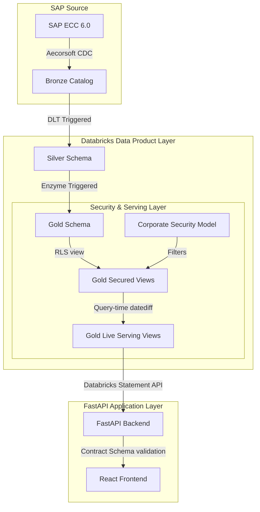

# Connected Operations Intelligence — Comprehensive Architecture & Product Readiness Review

This document provides a detailed architectural review and production-readiness assessment of the **Connected Operations Intelligence** monorepo. It evaluates the alignment of the Databricks DLT/Lakeflow pipeline data-product layer with the FastAPI/React application, analyzes the 44 new commits merged on `main` (including Shortage Projection, Expiry Risk, Adherence Root Cause, dynamic contract-resolver routing, and the OKF bundle mandate), identifies critical rollout risks, and recommends a phased remediation backlog.

---

## 1. Executive Verdict & Scoring

| Dimension | Score | Verdict |
| :--- | :---: | :--- |
| **Architecture Direction** | **9 / 10** | **Excellent structural blueprint**. The migration of date-relative, non-deterministic logic to query-time serving views (`*_live`) built on RLS views (`*_secured`) is a highly sound pattern that preserves Enzyme incrementalization. The introduction of the Open Knowledge Format (OKF) bundle and generator guarantees that data contracts remain the single source of truth. |
| **Production Readiness** | **6 / 10** | **In Progress**. Major progress has been made with the delivery of the WM Operations workspace (Shortage Projection, Expiry Risk, and Adherence Root Cause). However, a critical API route is still missing (`/api/cq/lab/plants`), unmigrated domains still bypass the contract resolver, and the home dashboard remains pilot-grade mock data. |
| **Databricks Best-Practice Alignment** | **8 / 10** | **Strong**. Triggered serverless Medallion pipelines, Enzyme-managed materialized views, and liquid clustering are correctly applied. The addition of the client-level `batch_master` silver table resolved a key data gap for FEFO. The AST-based determinism checks are excellent. |
| **SAP Functional Correctness** | **8 / 10** | **Good**. Resilience against Aecorsoft datetime variations is robust. The new `adherence_root_cause` classifies late release, material shortage, and capacity lag accurately. However, capacity modeling remains disabled due to KAPA schema gaps, and there is a high risk of orphaned outbound delivery items. |
| **App Maintainability** | **7 / 10** | **Moderate-High**. React and FastAPI remain modular. The addition of the dynamic `SIMPLE_DATASETS` router mapping in [wm_operations_databricks_adapter.py](file:///home/timgeldard/github/connected-operations-intelligence/apps/api/adapters/wm_operations/wm_operations_databricks_adapter.py) is clean, but a major governance loophole has been introduced where new domains bypass the migration registry guard. |
| **Operational Supportability** | **6 / 10** | **Moderate**. Excellent offline OKF conformance and DLT PySpark unit tests have been added. However, the root `tests/` directory remains empty (no integration or E2E tests), and metastore groups are unverified in UAT. |

---

## 2. Top 10 Strengths

1. **Deterministic MVs + Query-Time Serving Views**: By removing `current_date()` calls from the base Gold materialized views and migrating them to `_live` serving views (generated via [generate_gold_serving_views_sql.py](file:///home/timgeldard/github/connected-operations-intelligence/data-products/io-reporting/scripts/generate_gold_serving_views_sql.py)), the architecture guarantees Enzyme incrementalization while serving dynamic, date-relative ranges (e.g. risk bands, expiry buckets) at zero refresh cost.
2. **Double-Secured serving views**: Each `*_live` view is built directly on top of the matching `*_secured` view, ensuring it inherits the plant row-level security (RLS) filter and does not bypass Central Security Model policies.
3. **Open Knowledge Format (OKF) Bundle Mandate**: Enforces contract synchronicity by requiring that any change to the [app_contract_manifest.yml](file:///home/timgeldard/github/connected-operations-intelligence/data-products/io-reporting/contracts/app_contract_manifest.yml) must regenerate the OKF bundle under [okf/](file:///home/timgeldard/github/connected-operations-intelligence/data-products/io-reporting/okf/) via `make generate-okf`.
4. **CI-Enforced Contract Drift Guards**: The CI pipeline runs [check_okf_bundle_fresh.py](file:///home/timgeldard/github/connected-operations-intelligence/scripts/ci/check_okf_bundle_fresh.py) and [test_okf_bundle.py](file:///home/timgeldard/github/connected-operations-intelligence/data-products/io-reporting/tests/test_okf_bundle.py) to block merges with stale or invalid documentation.
5. **Decoupled Contract Resolver**: Governed domains like `warehouse360` and `wm_operations` resolve fully-qualified physical views at runtime through the centralized contract resolver in [contract_resolver.py](file:///home/timgeldard/github/connected-operations-intelligence/apps/api/shared/query_service/contract_resolver.py).
6. **Robust FEFO Expiry Risk Engine**: The `gold_wm_expiry_risk` model in [wm_operations_gold.py](file:///home/timgeldard/github/connected-operations-intelligence/data-products/io-reporting/gold/wm_operations_gold.py) successfully joins the new client-level `batch_master` (MCH1) table with plant-scoped `batch_stock` to flag First Expiring, First Out (FEFO) issues.
7. **Schedule Adherence Root Cause Classification**: The new `gold_wm_adherence_root_cause` table implements a rigorous prioritization (LATE_RELEASE > MATERIAL_SHORT > CAPACITY > UNCLASSIFIED) to automate bottleneck diagnostic reporting.
8. **Dynamic Router Dataset Mapping**: The use of `SIMPLE_DATASETS` in [wm_operations_databricks_adapter.py](file:///home/timgeldard/github/connected-operations-intelligence/apps/api/adapters/wm_operations/wm_operations_databricks_adapter.py) reduces route boilerplate in FastAPI, mapping multiple routes to their respective contract definitions dynamically.
9. **AST-Based Determinism Guards**: The CI scanner (`check_gold_mv_determinism.py`) prevents developers from introducing non-deterministic expressions in DLT materialized tables.
10. **Dual-Format Datetime Resilience**: The `sap_date()` and `sap_datetime()` helpers in [helpers.py](file:///home/timgeldard/github/connected-operations-intelligence/data-products/io-reporting/silver/helpers.py) gracefully parse both Aecorsoft compact (`yyyyMMdd`) and ISO (`yyyy-MM-dd`) formats.

---

## 3. Top 10 Critical Risks

### Risk 1: Missing `/api/cq/lab/plants` Route in Backend (P0)
* **Evidence**: The React Quality Lab Board standalone view queries `useConnectedQualityLabPlants()`, which calls the API route `/api/cq/lab/plants` (defined in [connected-quality-lab-databricks-adapter.ts:L102](file:///home/timgeldard/github/connected-operations-intelligence/domain-integrations/quality/src/adapters/connected-quality-lab-databricks-adapter.ts#L102)). However, this route is completely missing from all router files in `apps/api/routes/`.
* **Impact**: When `BACKEND_ADAPTER_MODE=databricks-api` is active, the Quality Lab Board throws a 404, resulting in an empty plant dropdown picker in UAT and production.
* **Remediation**: Add the `/cq/lab/plants` GET route to [quality_lab.py](file:///home/timgeldard/github/connected-operations-intelligence/apps/api/routes/quality_lab.py) and map it to `get_lab_plants_spec` in the `QualityLabRepository`.

### Risk 2: Severe Loophole in Contract Migration Registry Guard (P1)
* **Evidence**: The new `quality_lab` and `wm_operations` domains are not registered in the [app_migration_registry.yml](file:///home/timgeldard/github/connected-operations-intelligence/data-products/io-reporting/contracts/app_migration_registry.yml). Because the registry guard script [check_app_migration_registry_guard.py](file:///home/timgeldard/github/connected-operations-intelligence/scripts/ci/check_app_migration_registry_guard.py) only validates directories listed in the registry, these two directories completely bypassed sequencing restrictions.
* **Impact**: Developers can bypass migration gates and deploy direct data access queries without undergoing UAT validation checks or registry approval.
* **Remediation**: Update [check_app_migration_registry_guard.py](file:///home/timgeldard/github/connected-operations-intelligence/scripts/ci/check_app_migration_registry_guard.py) to scan all subdirectories under `apps/api/adapters/` and fail if any unregistered folder contains direct data access.

### Risk 3: Hardcoded Mock Data on Home Dashboard (P1)
* **Evidence**: The main landing page [RoleAwareHome.tsx](file:///home/timgeldard/github/connected-operations-intelligence/apps/web/src/pages/RoleAwareHome.tsx) uses hardcoded static arrays (`MOCK_PRIORITY_RELEASE_ITEMS`, `MOCK_SPC_SIGNALS`, `MOCK_WAREHOUSE_HOLDS`) rather than API calls.
* **Impact**: Plant managers and operators are presented with static, pilot-grade placeholder data upon logging in, which could lead to confusion or operational mistakes.
* **Remediation**: Implement FastAPI routes for these home widgets, back them with conformed `vw_consumption_*` views, and replace the static arrays with React Query hooks.

### Risk 4: Bypassing of Contract Resolver in Unmigrated Domains (P1)
* **Evidence**: Except for `warehouse360` and `wm_operations`, all other domains (POH, CQ, SPC, Trace2) bypass the contract manifest and query raw tables directly via `resolve_domain_object` in their adapters (e.g. `poh_databricks_adapter.py`, `spc_databricks_adapter.py`). Even the new `quality_lab` adapter uses `resolve_domain_object` directly in [quality_lab_databricks_adapter.py:L97](file:///home/timgeldard/github/connected-operations-intelligence/apps/api/adapters/quality_lab/quality_lab_databricks_adapter.py#L97) instead of `resolve_contract_object`.
* **Impact**: These domains bypass the contract schema-validation checks. Any schema changes in the DLT pipelines will cause silent runtime failures in the application.
* **Remediation**: Scaffold contracts for these unmigrated domains in `app_contract_manifest.yml` and migrate their adapters to use `resolve_contract_object`.

### Risk 5: Empty Root Testing Folders (P1)
* **Evidence**: The directories [tests/contract/](file:///home/timgeldard/github/connected-operations-intelligence/tests/contract), [tests/integration/](file:///home/timgeldard/github/connected-operations-intelligence/tests/integration), and [tests/e2e/](file:///home/timgeldard/github/connected-operations-intelligence/tests/e2e) contain only `.gitkeep` files.
* **Impact**: There is no automated testing of end-to-end user flows, API integration, or data contract compliance before deployment to UAT.
* **Remediation**: Implement a baseline suite of E2E tests using Playwright and integration tests to verify the FastAPI-to-Databricks queries.

### Risk 6: Developer-Scoped Bundle Deployments in UAT/Prod (P1)
* **Evidence**: In [databricks.yml:L142](file:///home/timgeldard/github/connected-operations-intelligence/data-products/io-reporting/databricks.yml#L142) and [databricks.yml:L168](file:///home/timgeldard/github/connected-operations-intelligence/data-products/io-reporting/databricks.yml#L168), UAT and Prod deployment paths default to `/Workspace/Users/${workspace.current_user.userName}/.bundle/...`.
* **Impact**: Multiple developers deploying to the same UAT workspace will create duplicate pipeline and job instances, leading to write conflicts and schema locks.
* **Remediation**: Set up a CI/CD service principal deployment path under `/Workspace/Deployments/` with restricted access permissions.

### Risk 7: Orphaned Outbound Delivery Items (P2)
* **Evidence**: In `warehouse_flow_gold.py:L153` (defined in the data-products layer), `anti_join_optional_deleted_headers` checks `outbound_delivery_header_delete` by `delivery_number`. However, header-only deletes (where item fields are null) leave orphaned delivery items in the silver layer.
* **Impact**: Outbound picking dashboards may display deleted delivery lines, misleading operators into processing canceled shipments.
* **Remediation**: Update the anti-join logic to apply deletes at the document header level, removing all items associated with a deleted delivery number.

### Risk 8: Partially Decommissioned Domain Remnants (P2)
* **Evidence**: The backend route and adapter for `envmon` have been deleted, but the frontend still imports `envmonConsumerRegistration` in [workspace-registry.ts:L5](file:///home/timgeldard/github/connected-operations-intelligence/apps/web/src/registry/workspace-registry.ts#L5) and defines `di-envmon` aliases in build files.
* **Impact**: The UI mounts the Environmental Monitoring tab, but clicking it results in runtime errors and failed API calls.
* **Remediation**: Remove `envmon` references from [workspace-registry.ts](file:///home/timgeldard/github/connected-operations-intelligence/apps/web/src/registry/workspace-registry.ts), `vite.config.ts`, and delete the empty `domain-integrations/envmon/` directory.

### Risk 9: Capacity Utilisation Data Ingestion Gap (P2)
* **Evidence**: In [reference.py:L216](file:///home/timgeldard/github/connected-operations-intelligence/data-products/io-reporting/silver/tables/reference.py#L216), the `capacity_utilisation` table is disabled because required columns (e.g. `DAFBI`, `DAFEI`) are missing from the replicated `shiftparametersavailablecapacity_kapa` table.
* **Impact**: Any future capacity monitoring or line-scheduling features will display empty datasets.
* **Remediation**: Update the Aecorsoft replication configuration to sync the full schema for the `KAPA` table.

### Risk 10: Missing Consumer Groups in UAT Metastore (P2)
* **Evidence**: The UAT migration readiness checklist notes that the `users` and `warehouse360_app_users` consumer groups do not exist in the UAT metastore, which blocks grants and security hardening.
* **Impact**: Row-level security cannot be verified in UAT, risking data leaks during pilot testing.
* **Remediation**: Provision the consumer groups in Unity Catalog and sync them with the UAT workspace identity provider.

---

## 4. Section-by-Section Review

### A. Executive Summary
The monorepo is designed to act as an integrated manufacturing operations intelligence platform. The architectural direction of utilizing conformed contracts and query-time serving views is excellent. However, due to incomplete migrations across multiple domains, a critical missing route in the quality lab board, and a lack of end-to-end testing, the repository is **not production-ready**.

### B. Databricks Architecture
* **Medallion structure**: Standard Bronze -> Silver -> Gold layout. Silver is the conformed layer, while Gold handles reporting aggregates.
* **DLT/Lakeflow pipeline**: Set up as triggered serverless pipelines, optimizing cost between runs.
* **Liquid clustering**: Enabled on large tables (e.g. `material`, `process_order`, `batch_master`) to ensure fast query times.
* **Non-deterministic values**: Evaluated at query-time in serving views (`_live`) built on RLS views (`_secured`), preserving base MV incrementalization.

### C. Data Contracts & App Boundary
* **Contracts**: Defined in [app_contract_manifest.yml](file:///home/timgeldard/github/connected-operations-intelligence/data-products/io-reporting/contracts/app_contract_manifest.yml).
* **Coupling**: High coupling remains in unmigrated domains (POH, CQ, SPC, Trace2) where adapters query tables directly.
* **Loophole**: `quality_lab` bypasses the contract manifest entirely by querying `vw_consumption_quality_lab_fails` through `resolve_domain_object` instead of `resolve_contract_object`. Both `quality_lab` and `wm_operations` bypass the CI registry guard.

### D. Security & Governance
* **Row-Level Security**: Secured serving views (`*_secured`) implement plant-level filtering using `published_<env>.security.model`.
* **Testing Security**: Standardized gates support test modes (`validation_open`, `validation_fixture`) to validate data shape without access to corporate security model tables.
* **Metastore groups**: The UAT metastore is missing the `users` consumer group, meaning security policies cannot be enforced.

### E. Deployment & Environments
* **Workspace path conflict**: Developer-scoped deployment paths `/Workspace/Users/...` in `databricks.yml` create resource duplication and schema locks in UAT/prod targets.
* **Secret Handling**: Handled correctly through Databricks secret scopes, but app parameters are set as static environment variables in `app.yaml` because DAB variable substitution is not supported in `app.yaml`.

### F. Data Quality & Observability
* **Observability**: Handled via `gold_data_freshness_status` and `gold_data_health_summary` tables.
* **Freshness**: The `gold_critical_freshness_gate` fails the Gold pipeline when any critical Silver table goes stale, preventing users from acting on stale information.

### G. SAP Functional Coverage
* **Process Orders (PP-PI)**: Correctly filtered on order category `AUTYP='40'`.
* **Batch Traceability**: ADR 016 limits batch trace queries to a 5-year lookback window to reduce the lineage edge count.
* **Capacity Utilisation**: Currently disabled due to missing columns in replication.
* **Orphaned items**: Risk of orphaned outbound delivery items from header-only deletes.

### H. Application Architecture
* **FastAPI Router**: Clean routing structure, but missing the `/cq/lab/plants` route.
* **Database Connection**: Uses the Databricks Statement API with forwarded user OAuth tokens, ensuring the identity is propagated to Unity Catalog for RLS views.
* **Queryspecs**: `packages/queryspecs` is a dummy package containing only a version constant.

### I. Product & UX Readiness
* **Mock widgets**: The main landing page is heavily mock-driven, presenting users with placeholder list items.
* **Maturity labeling**: Freshness and data maturity markers are present in the code but not exposed in the UI.

### J. Testing & CI
* **Unit tests**: Excellent PySpark unit tests for DLT pipelines.
* **CI guards**: Strict CI guards validate SQL drift, duplicate DLT names, forbidden data access, and OKF bundle drift.
* **Monorepo tests**: The root `tests/` directory is empty, meaning there are no automated E2E or integration tests.

---

## 5. Recommended Target Architecture

* **Data Layer**: Triggered serverless Medallion pipelines.
* **Serving Layer**: `_live` serving views built on top of `_secured` views.
* **Application Layer**: FastAPI adapters resolving queries via `resolve_contract_object` to fetch conformed views.
* **Security Model**: Plant-level row filtering enforced via `published_<env>.security.model`.
* **Deployment Model**: Unified deployment using a CI/CD service principal deploying to an access-controlled `/Workspace/Deployments/` directory.

---

## 6. Recommended Backlog

### Immediate P0 Fixes
1. Add the missing GET `/api/cq/lab/plants` endpoint to [quality_lab.py](file:///home/timgeldard/github/connected-operations-intelligence/apps/api/routes/quality_lab.py).
2. Update [check_app_migration_registry_guard.py](file:///home/timgeldard/github/connected-operations-intelligence/scripts/ci/check_app_migration_registry_guard.py) to scan all adapter directories and fail on unregistered adapters.
3. Remove decommissioned `envmon` remnants from the frontend files ([workspace-registry.ts](file:///home/timgeldard/github/connected-operations-intelligence/apps/web/src/registry/workspace-registry.ts), `vite.config.ts`).

### Next 30 Days (Sprint 2 / Parity & Hardening)
1. Scaffold contracts for unmigrated domains (POH, CQ, SPC, Trace2) in [app_contract_manifest.yml](file:///home/timgeldard/github/connected-operations-intelligence/data-products/io-reporting/contracts/app_contract_manifest.yml) and route them through `resolve_contract_object`.
2. Migrate the developer-scoped deployment paths in UAT/prod targets to a unified `/Workspace/Deployments/` path.
3. Implement a baseline of Playwright E2E and integration tests in `tests/`.

### Next 90 Days (Sprint 3 / Operationalization)
1. Replace the hardcoded mock widgets on [RoleAwareHome.tsx](file:///home/timgeldard/github/connected-operations-intelligence/apps/web/src/pages/RoleAwareHome.tsx) with live API integrations.
2. Resolve the orphaned outbound delivery items issue by refactoring the delete anti-join logic in [warehouse_flow_gold.py](file:///home/timgeldard/github/connected-operations-intelligence/data-products/io-reporting/gold/warehouse_flow_gold.py).
3. Coordinate with the platform team to provision the consumer groups (`users`, `warehouse360_app_users`) in the UAT metastore.

---

## 7. Questions to Ask Before Production Rollout

1. **Security & Identity**: Has the corporate Central Security Model (`published_prod.security.model`) been populated with the necessary `io_reporting` user entitlements for production?
2. **Unity Catalog Groups**: Are the `users` and application-specific consumer groups provisioned in the production Unity Catalog metastore?
3. **Data Freshness SLAs**: Have the operational users agreed on the 15-minute triggered pipeline latency SLA, and does it justify the serverless DLT execution costs?
4. **Replication Gaps**: When will Aecorsoft replication be updated to include the missing capacity (`KAPA`) and outbound delivery fields?
5. **Ownership of Master Data**: Who owns the `site_lifecycle_config` master data review for sold, closed, and divested plants?
