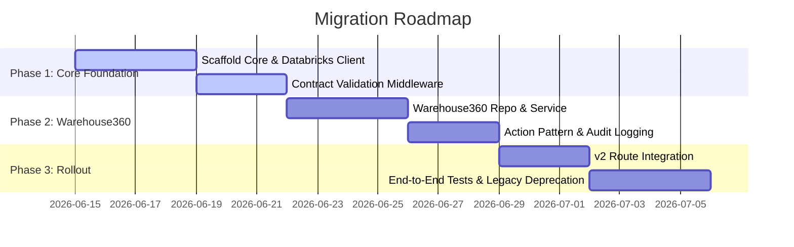
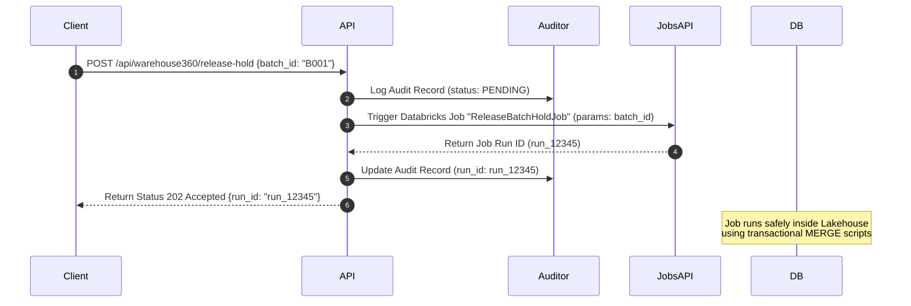

# Architectural Proposal: Evolving FastAPI into a Production-Grade Data Service

This document outlines the evaluation, proposed target architecture, migration roadmap, and concrete code blueprints to transition the ConnectIO backend (`apps/api/`) from a thin "data product query layer" into a robust, observable, and secure **operational Data Service**.

---

## 1. Executive Recommendation

### **Verdict: Yes (Proceed with Phased Implementation)**

Evolving the backend into a conformed, production-grade operational service is **highly recommended** before the platform goes live on the shop floor.

#### **Why Doing it Now is Critical:**
1. **Operational Transition (Read-only → Writes)**: The current application is primarily read-only. However, shop-floor execution requires safe actions (e.g. releasing batch holds, staging components). A thin query-passthrough layer cannot safely govern mutations, orchestrate job runs, or record audit trails.
2. **Post-Live Regression Prevention**: Once the app is deployed to active 24/7 manufacturing plants, refactoring the core directory layout, middleware, and dependency boundaries becomes significantly harder due to strict downtime windows and production SLAs.
3. **Hardening Sprint Alignment**: This proposal directly supports the hardening sprint goals of **governance and safety** by adding contract-enforcement middleware and a strict action-audit logging layer.

*To minimize risk, the transition must be executed in a **strictly backward-compatible** manner, running the new service structure in parallel with legacy routes during the migration phase.*

---

## 2. Target Folder Structure

We propose moving from the current flat layout to a clean **Domain-Driven Design (DDD)** structure under `apps/api/`:

```
apps/api/
├── core/                        # Cross-cutting concerns (config, security, telemetry, middleware)
│   ├── config.py                # Environment and configuration loading
│   ├── telemetry.py             # OpenTelemetry setup and structured JSON logging
│   └── middleware/
│       ├── contract_validator.py # Request/Response data contract enforcement
│       └── request_logging.py   # Request-scoped transaction logging
├── domain/                      # Pure business logic and entity interfaces (framework-agnostic)
│   ├── warehouse360/
│   │   ├── models.py            # Domain-specific models and schemas
│   │   └── interfaces.py        # Repository and service class interfaces
│   └── shared/
│       └── audit.py             # Shared AuditLog domain model
├── infrastructure/              # Framework-specific database/API implementations
│   ├── databricks/
│   │   ├── client.py            # Robust, pool-managed Statement API client
│   │   └── repository.py        # Base repository implementing Statement mapping
│   ├── persistence/
│   │   ├── warehouse360_repository.py # Databricks-specific Warehouse360 repo
│   │   └── redis_cache.py       # Redis cache client & query cache-tier persistence
│   └── telemetry/
│       └── otel_exporter.py     # OpenTelemetry collector wiring
├── services/                    # Application services orchestrating domain logic & writes
│   ├── warehouse360_service.py  # Coordinates warehouse query validation, caching, and actions
│   └── action_auditor.py        # Audit recorder for write operations
├── routes/                      # FastAPI Controllers (thin routing layer)
│   ├── v1/                      # Legacy routes (kept for backward compatibility)
│   ├── v2/                      # Refactored routes using Dependency Injection
│   │   └── warehouse360.py      # Refactored Warehouse360 endpoints
│   └── health.py                # Health endpoints with deep checks (Redis, Databricks)
└── main.py                      # FastAPI app assembly and Lifespan coordinator
```

---

## 3. Phase 1 Implementation Plan (Next 1-2 Weeks)

The migration is split into three phases to guarantee zero-downtime development:



### **Phase 1: Core Foundation & Safety Gates (Effort: 7 Days)**
* **Deliverable 1**: Scaffold `apps/api/core/` and implement the robust `DatabricksQueryClient`.
* **Deliverable 2**: Implement the `ContractValidatorMiddleware` in `apps/api/core/middleware/` to intercept and log response contract drift in UAT.
* **Deliverable 3**: Establish unit-testing infrastructure for mock client responses.

---

## 4. Detailed Architecture & Code Examples

### A. Robust Databricks Query Client ([client.py](file:///home/timgeldard/github/connected-operations-intelligence/apps/api/infrastructure/databricks/client.py))

A robust client encapsulating pool management, exponential backoff, rate limiting, and timeout metrics.

```python
import asyncio
import logging
import time
from typing import Any, Dict, List
import httpx
from shared.query_service.errors import (
    DatabricksRateLimitError,
    DatabricksQueryTimeoutError,
    DatabricksQueryError,
)

_log = logging.getLogger("connectio.databricks_client")

class DatabricksQueryClient:
    """Production-grade Statement API client with retry and logging policies."""
    
    def __init__(self, host: str, token: str, max_retries: int = 3, base_backoff: float = 0.5):
        self.host = host.rstrip("/")
        self.token = token
        self.max_retries = max_retries
        self.base_backoff = base_backoff
        self.client = httpx.AsyncClient(
            headers={"Authorization": f"Bearer {token}"},
            timeout=httpx.Timeout(30.0, connect=5.0),
            limits=httpx.Limits(max_keepalive_connections=20, max_connections=50)
        )

    async def execute_statement(
        self, 
        warehouse_id: str, 
        sql: str, 
        params: Dict[str, Any], 
        tags: Dict[str, str]
    ) -> List[Dict[str, Any]]:
        url = f"https://{self.host}/api/2.0/sql/statements"
        payload = {
            "warehouse_id": warehouse_id,
            "statement": sql,
            "parameters": [{"name": k, "type": "STRING", "value": str(v)} for k, v in params.items()],
            "on_wait_timeout": "25s"  # Block up to 25s waiting for inline execution
        }

        for attempt in range(1, self.max_retries + 1):
            start_time = time.monotonic()
            try:
                r = await self.client.post(url, json=payload, headers={"X-Databricks-Tags": str(tags)})
                
                # Handle Rate Limit (HTTP 429)
                if r.status_code == 429:
                    raise DatabricksRateLimitError("Rate limit exceeded on Databricks SQL Warehouse.")
                
                r.raise_for_status()
                res = r.json()
                status = res.get("status", {}).get("state")

                if status == "SUCCEEDED":
                    return self._map_result_schema(res)
                elif status in ("PENDING", "RUNNING"):
                    # Long-running query: poll statement ID until completion
                    return await self._poll_statement(res["statement_id"])
                else:
                    raise DatabricksQueryError(f"Query execution failed with status: {status}")

            except (httpx.ConnectTimeout, httpx.ReadTimeout) as exc:
                if attempt == self.max_retries:
                    raise DatabricksQueryTimeoutError("Statement execution timed out at gateway level.") from exc
                
                backoff = self.base_backoff * (2 ** (attempt - 1))
                _log.warning(f"Timeout on attempt {attempt}. Retrying in {backoff}s...")
                await asyncio.sleep(backoff)
                
            except Exception as exc:
                _log.error(f"Execution failed on attempt {attempt}: {str(exc)}")
                if attempt == self.max_retries:
                    raise exc

        raise DatabricksQueryError("Failed to execute statement after retries.")

    async def _poll_statement(self, statement_id: str) -> List[Dict[str, Any]]:
        # Polling loop with exponential backoff
        ...
```

---

### B. Contract Validation Middleware ([contract_validator.py](file:///home/timgeldard/github/connected-operations-intelligence/apps/api/core/middleware/contract_validator.py))

Intercepts outbound API responses and validates their structures against generated Pydantic models.

```python
import logging
from fastapi import Request, Response
from starlette.middleware.base import BaseHTTPMiddleware
from contracts.generated import ConnectioDataContracts

_log = logging.getLogger("connectio.contract_validator")

class ContractValidatorMiddleware(BaseHTTPMiddleware):
    """Enforces strict outbound data contract validation, logging drift events."""
    
    async def dispatch(self, request: Request, call_next):
        response: Response = await call_next(request)
        
        # Only validate API response schemas, ignoring static asset loads
        if not request.url.path.startswith("/api/"):
            return response

        # Read response body safely without exhausting stream
        response_body = [section async for section in response.body_iterator]
        response.body_iterator = iterate_in_background(response_body)
        raw_json = b"".join(response_body).decode("utf-8")

        # Resolve expected Pydantic model based on route metadata mapping
        expected_model = self._resolve_model_for_route(request.url.path)
        if expected_model:
            try:
                expected_model.model_validate_json(raw_json)
            except Exception as e:
                # Log contract drift as a high-severity alert
                _log.error(
                    "CONTRACT DRIFT DETECTED",
                    extra={
                        "path": request.url.path,
                        "error": str(e),
                        "payload": raw_json[:1000]
                    }
                )
                # In development/UAT, raise 500 error to block merging drifted codes
                if os.getenv("APP_ENV") in ("development", "uat"):
                    return Response(
                        status_code=500,
                        content=f"Contract Drift Alert: Response violates contract schema: {str(e)}"
                    )
        
        return response
```

---

### C. Example Domain Service ([warehouse360_service.py](file:///home/timgeldard/github/connected-operations-intelligence/apps/api/services/warehouse360_service.py))

Handles query coordination, caching logic, and plant-level validation checks.

```python
from typing import List, Optional
from domain.warehouse360.interfaces import IWarehouse360Repository
from contracts.generated import Warehouse360InboundItem
from services.action_auditor import ActionAuditor

class Warehouse360Service:
    """Coordinates business logic and query optimization for the Warehouse360 cockpit."""
    
    def __init__(self, repo: IWarehouse360Repository, auditor: ActionAuditor):
        self.repo = repo
        self.auditor = auditor

    async def get_inbound_backlog(
        self, 
        warehouse_id: str, 
        plant_id: Optional[str], 
        limit: int
    ) -> List[Warehouse360InboundItem]:
        # Business Constraint: limit cannot exceed 500 records
        safe_limit = min(limit, 500)
        
        # Fetch clean domain rows from repository
        rows = await self.repo.fetch_inbound_backlog(warehouse_id, plant_id, safe_limit)
        
        # Perform domain-level calculations if required (e.g. dynamic aging category mapping)
        return rows
```

---

### D. Safe Asynchronous Action/Workflow Pattern

Since the API layer is strictly forbidden from executing direct write queries (`INSERT`/`UPDATE`) against Delta tables, all business actions must follow a safe async pattern:



This ensures write operations are fully governed, audit-logged, and executed using Databricks computing workloads rather than vulnerable Web server threads.

---

## 5. Remaining Gaps & Roadmap

1. **Redis Cache Deployment**: The backend lacks a Redis resource in local dev and staging. Caching currently defaults to an in-memory dictionary.
2. **Audit Target Catalog**: A dedicated governance schema `connected_plant.security.api_audit_log` must be scaffolded to capture the output of `ActionAuditor`.
3. **Data-Contracts Generation Gaps**: Currently, custom schemas (such as SPC rules and shortfall exceptions) are coded manually in Python routes rather than being auto-generated.

---

## 6. Recommended Packages

To support this evolved architecture, we recommend adding the following Python libraries:
* **`opentelemetry-api` & `opentelemetry-sdk`**: For standards-compliant request tracing and span propagation.
* **`structlog`**: For high-performance structured JSON logging on production pipelines.
* **`redis`**: For centralized cache management across scale-out API gateway nodes.
* **`tenacity`**: For standardized, configurable retry behaviors on external Databricks endpoints.
