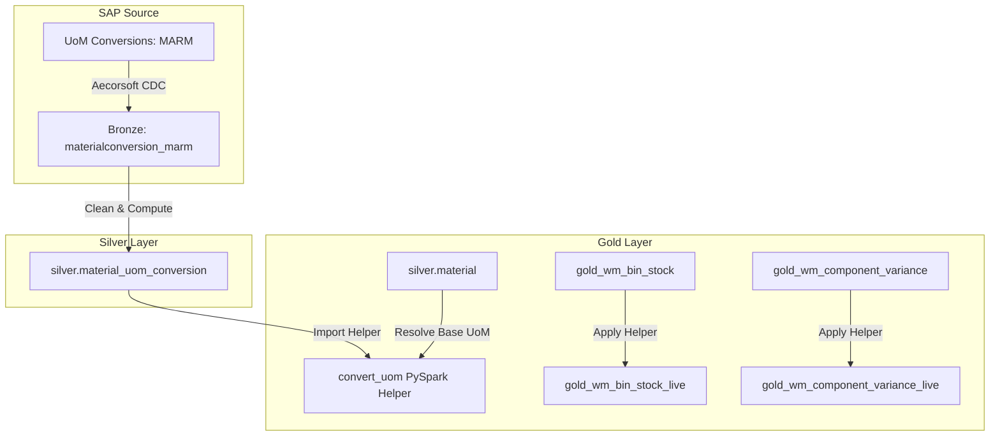

# Centralized Unit of Measure (UoM) Converter Specification

This document defines the architectural design, data schemas, and PySpark implementation blueprint for the **Centralized Unit of Measure (UoM) Converter**. 

This data-service utility prevents aggregation errors and quantity mismatches by dynamically unifying alternative units of measure (e.g., cases, cartons, bags, pallets) into a conformed target unit (typically the SAP Base Unit or weight equivalent like KG) in the Gold reporting layer.

---

## 1. The Problem Statement

In SAP manufacturing and warehousing environments, quantities are recorded across different units of measure depending on the business process:

* **Base Unit of Measure (BUoM)**: The unit in which inventory is managed in the warehouse (e.g., `KG`, `EA`, `L`). Defined on the Material Master (`MARA.MEINS`).
* **Alternative Unit of Measure (AUoM)**: The unit in which production orders, staging requests, or purchases are requested (e.g., `CAR` for cartons, `PAL` for pallets, `BAG` for bags). Defined in the Material Units of Measure table (`MARM`).
* **The Conflict**: When the Gold layer aggregates quantities (e.g. summing total open inventory for a warehouse zone or calculating component yield variances), it cannot mathematically add `CAR` and `KG` without a conversion factor. Doing so causes critical reporting errors.

---

## 2. SAP UoM Data Model

SAP defines material-specific conversions in the `MARM` table using a numerator (`UMREZ`) and denominator (`UMREN`) structure to avoid decimal precision loss:

$$\text{Quantity in Base Unit (BUoM)} = \text{Quantity in Alternative Unit (AUoM)} \times \left( \frac{\text{UMREZ}}{\text{UMREN}} \right)$$

For example, if a material has a Base Unit of `KG` and an Alternative Unit of `CAR` (Carton), where 1 Carton = 25.5 KG:
* $\text{Alternative Unit (MEINH)} = \text{"CAR"}$
* $\text{Numerator (UMREZ)} = 255$
* $\text{Denominator (UMREN)} = 10$
* Conversion Ratio: $\frac{255}{10} = 25.5$

---

## 3. Unified UoM Converter Architecture

The converter runs as a two-stage service:



1. **Silver Layer (`silver.material_uom_conversion`)**: Cleans the Bronze `materialconversion_marm` table, calculating a pre-divided floating-point `conversion_factor_to_base` for every valid `material_code` and alternative unit pair.
2. **Gold Layer Helper (`convert_uom`)**: A conformed PySpark function that dynamically joins the Silver conversion table to scale quantities from their source unit to a target unit. It resolves base units against `silver.material` to safely identify unverified conversions.

---

## 4. Code Implementation Blueprint

### A. Silver Table Definition ([reference.py](../../data-products/io-reporting/silver/tables/reference.py))

The Silver table is materialized in [reference.py](../../data-products/io-reporting/silver/tables/reference.py) as follows:

```python
@dlt.table(
    name="material_uom_conversion",
    comment=(
        "SAP MARM alternate-unit conversion factors. "
        "qty_in_base_uom = qty_in_alt_uom * numerator / denominator. "
        "Base UoM per material is MARA-MEINS, available in silver.material.base_uom."
    ),
    table_properties={"delta.enableChangeDataFeed": "true"},
)
@dlt.expect_all_or_drop({
    "material_code present": "material_code IS NOT NULL",
    "alternate_uom present": "alternate_uom IS NOT NULL",
    "valid_conversion": "is_valid_conversion = true",
})
def material_uom_conversion():
    spark = get_spark()
    src = spark.read.table(f"{BRONZE}.materialconversion_marm")
    return src.select(
        strip_zeros("MATNR").alias("material_code"),
        F.col("MATNR").alias("material_code_raw"),
        F.col("MEINH").alias("alternate_uom"),
        F.col("UMREZ").cast("double").alias("numerator"),
        F.col("UMREN").cast("double").alias("denominator"),
        F.when(
            F.col("UMREN").cast("double") != 0,
            F.col("UMREZ").cast("double") / F.col("UMREN").cast("double"),
        ).otherwise(F.lit(None).cast("double")).alias("conversion_factor_to_base"),
        (F.col("UMREN").cast("double") != 0).alias("is_valid_conversion"),
        F.col("AEDATTM").alias("_replicated_at"),
    )
```

### B. PySpark Gold Helper ([_shared.py](../../data-products/io-reporting/gold/_shared.py))

The conformed PySpark helper in [_shared.py](../../data-products/io-reporting/gold/_shared.py) dynamically performs scale conversion with built-in unverified safety flags:

```python
def convert_uom(
    df: DataFrame,
    material_col: str,
    qty_col: str,
    from_uom_col: str,
    to_uom_col: str,
    output_col: str = "converted_qty"
) -> DataFrame:
    """Convert quantities between units of measure using the silver.material_uom_conversion table.

    Formula:
        converted_qty = qty * (from_factor / to_factor)
        where factors are the conversion factors to base UoM.
        If a factor is missing (i.e. not in MARM, which means it is already base UoM or unmapped),
        we default the factor to 1.0.

    Args:
        df: Input DataFrame.
        material_col: Name of column containing material codes.
        qty_col: Name of column containing source quantities to convert.
        from_uom_col: Name of column containing source UoM codes (e.g., 'CAR').
        to_uom_col: Name of column containing target UoM codes (e.g., 'KG').
        output_col: Name of the resulting converted quantity column.
    """
    from pyspark.sql import functions as F
    spark = df.sparkSession
    ss = get_silver_schema(spark)

    # Load conversion lookup table
    conv = spark.read.table(f"{ss}.material_uom_conversion")

    # 1. Join for "From UoM" conversion factor
    conv_from = conv.select(
        F.col("material_code").alias("_from_mat"),
        F.col("alternate_uom").alias("_from_uom"),
        F.col("conversion_factor_to_base").alias("from_factor")
    )

    df_from = df.join(
        conv_from,
        (F.col(material_col) == F.col("_from_mat")) & (F.upper(F.trim(F.col(from_uom_col))) == F.col("_from_uom")),
        "left"
    ).drop("_from_mat", "_from_uom")

    # 2. Join for "To UoM" conversion factor
    conv_to = conv.select(
        F.col("material_code").alias("_to_mat"),
        F.col("alternate_uom").alias("_to_uom"),
        F.col("conversion_factor_to_base").alias("to_factor")
    )

    df_to = df_from.join(
        conv_to,
        (F.col(material_col) == F.col("_to_mat")) & (F.upper(F.trim(F.col(to_uom_col))) == F.col("_to_uom")),
        "left"
    ).drop("_to_mat", "_to_uom")

    # 3. Load base UoM reference to identify unverified conversions
    # Material table is plant-scoped, so select distinct material_code/base_uom pairs
    mat_base = spark.read.table(f"{ss}.material").select(
        F.col("material_code").alias("_base_mat"), "base_uom"
    ).distinct()

    df_base = df_to.join(
        mat_base,
        F.col(material_col) == F.col("_base_mat"),
        "left"
    ).drop("_base_mat")

    # 4. Perform conversion logic with fallback safety
    # If factors are missing (left-join returns NULL), default to 1.0 to prevent null multiplication.
    # We flag unconvertible rows with a warning flag instead of nulling.
    result = df_base.withColumn(
        output_col,
        F.col(qty_col) * (
            F.coalesce(F.col("from_factor"), F.lit(1.0)) /
            F.coalesce(F.col("to_factor"), F.lit(1.0))
        )
    ).withColumn(
        "is_uom_conversion_unverified",
        # A conversion is unverified if:
        # - The from_uom is not the base_uom, and its conversion factor is missing (NULL)
        # - OR the to_uom is not the base_uom, and its conversion factor is missing (NULL)
        # We also check if from_uom is equal to to_uom (which is always 1:1, so verified).
        F.when(
            F.upper(F.trim(F.col(from_uom_col))) == F.upper(F.trim(F.col(to_uom_col))),
            F.lit(False)
        ).otherwise(
            ((~F.upper(F.trim(F.col(from_uom_col))).eqNullSafe(F.upper(F.trim(F.col("base_uom"))))) & F.col("from_factor").isNull()) |
            ((~F.upper(F.trim(F.col(to_uom_col))).eqNullSafe(F.upper(F.trim(F.col("base_uom"))))) & F.col("to_factor").isNull())
        )
    ).drop("from_factor", "to_factor", "base_uom")

    return result
```

---

## 5. Usage Example: Staging Component Variance

Here is an example of applying the UoM converter in [wm_operations_gold.py](../../data-products/io-reporting/gold/wm_operations_gold.py) to reconcile process order component reservations (which might be in alternative units like `CAR`) with actual goods movements (which are always recorded in the base unit `KG`):

```python
from gold._shared import convert_uom

def gold_wm_order_component_variance():
    spark = get_spark_session()
    ss = get_silver_schema(spark)
    
    # Raw reservation requirements
    res = spark.read.table(f"{ss}.reservation_requirement").select(
        "material_code", "order_number", "required_quantity", "base_uom"
    )
    
    # Goods movements (recorded in issue UoM)
    mvt = spark.read.table(f"{ss}.goods_movement").select(
        "material_code", "order_number", "quantity", "unit_of_measure", "base_uom"
    )
    
    # Reconcile quantities by converting goods movement 'unit_of_measure' to the reservation 'base_uom'
    mvt_converted = convert_uom(
        mvt,
        material_col="material_code",
        qty_col="quantity",
        from_uom_col="unit_of_measure",
        to_uom_col="base_uom",
        output_col="issued_quantity_conformed"
    )
    
    # Perform aggregation and calculate variance safely
    # ...
```

---

## 6. Validation Rules and Handling Missing Factors

1. **Unconvertible Flagging**: When a conversion factor is missing from `MARM`, `convert_uom` falls back to a 1:1 ratio and sets `is_uom_conversion_unverified = true`. This flags the record in the UI (e.g., rendering a warning icon next to the quantity) without throwing a pipeline runtime error.
2. **Quality Expectation Alerts**: In DLT pipelines, you can add an expectations check to log or alert on unverified conversions:
   ```python
   @dlt.expect("all_uom_conversions_verified", "is_uom_conversion_unverified = false")
   ```
3. **Audit Table Logging**: Create a derived view `gold_wm_unresolved_uom_conversions` capturing distinct material/alternative unit pairs where `from_factor` or `to_factor` was resolved as NULL, giving master-data teams a clear list of missing conversions in SAP.
