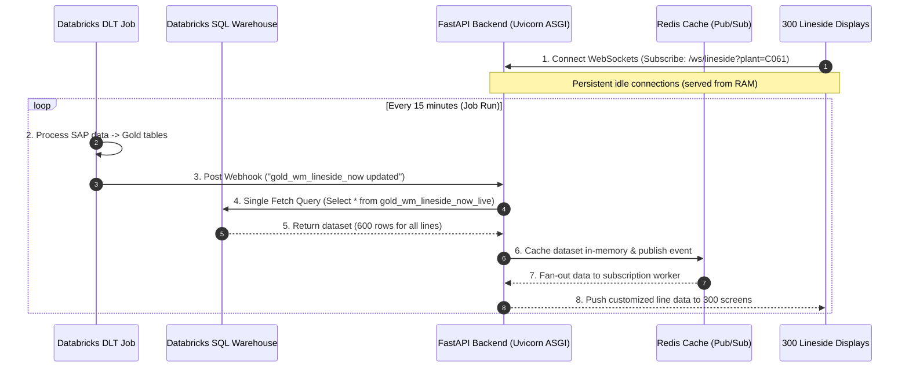

# Scalable Decoupled Architecture for 300+ Lineside Devices

To scale the real-time Lineside Monitor to **300+ devices** (e.g., factory wallboard displays) with **minimal cost impact**, we must decouple the client WebSocket connections from the Databricks query path.

Querying Databricks directly on behalf of 300 devices will exhaust the Statement API connection pools, trigger auto-scaling on the SQL Warehouse, and result in thousands of dollars in monthly DBU costs. The solution is the **Decoupled Broadcast Cache Architecture**.

---

## 1. Architectural Blueprint



---

## 2. Key Architecture Components

### A. Persistent WebSockets served from In-Memory Cache
* **FastAPI WebSockets**: The 300 lineside devices open a persistent WebSocket connection to the FastAPI backend. FastAPI handles these using asynchronous coroutines (ASGI/Uvicorn), which can support thousands of concurrent connections on a single 2-vCPU VM.
* **No Direct DB Queries**: When a device connects, it does **not** trigger a query to Databricks. Instead, the backend reads the latest snapshot from an in-memory cache (Redis or local memory) and returns it immediately.

### B. Push-on-Complete Webhook (Orchestrator Triggered)
* **The Webhook**: At the end of the Databricks Workflow Job (which runs the Gold DLT pipeline), you add a final lightweight task (Python script) that calls a FastAPI webhook:
  ```bash
  curl -X POST https://connectio-api/api/webhooks/pipeline-completed \
       -H "Content-Type: application/json" \
       -d '{"table": "gold_wm_lineside_now"}'
  ```
* **Single-Fetch Query**: Upon receiving this webhook, the FastAPI backend executes exactly **one query** to Databricks to fetch the active lineside data for all plants:
  ```sql
  SELECT plant_code, production_line, material_code, planned_qty, pct_complete, current_activity_type
  FROM `catalog`.`gold_io_reporting`.`gold_wm_lineside_now_live`
  ```
  Since there are 300 lines, this query returns roughly 600 rows (released/active orders only), taking less than a second.
* **Cache Update & Fan-out**: The backend writes the rows to Redis. Redis then fires a pub/sub event that pushes the updated data to the open WebSocket loops, which filters the rows and sends each device only the data for its configured `plant_code` and `production_line`.

### C. Auto-Suspension of SQL Warehouse
* Because the SQL Warehouse is only queried when the pipeline runs (e.g. 4 times per hour), it can safely auto-suspend when the system is idle.
* If using a **Serverless SQL Warehouse**, you can set the auto-suspend window to **1 minute**. The warehouse spins up instantly when the webhook fires, executes the single query in under a second, and suspends 60 seconds later.

---

## 3. Financial Cost Comparison

The following table compares the monthly costs of a direct-polling model versus the Decoupled Broadcast Cache model for 300 devices:

| Cost Vector | Direct Polling Model (10s intervals) | Decoupled Broadcast Cache Model (15m runs) |
| :--- | :--- | :--- |
| **SQL Warehouse State** | Running 24/7 (Cannot suspend) | Auto-suspends (Active ~4 min/hour) |
| **Queries to Databricks** | 2,592,000 queries / day | 96 queries / day |
| **Databricks Compute (DBU)** | ~180 DBUs/month (Small Warehouse, always on) | ~1.2 DBUs/month (Serverless 2X-Small) |
| **Databricks Cost** | **~$600 / month** | **~$4 / month** |
| **Cloud Storage API Fees** | ~$40 / month (Millions of GET/LIST calls) | Negligible |
| **FastAPI VM Cost** | **$200/month** (Heavy CPU load from polling) | **$20/month** (Idle WebSockets in RAM) |
| **Total Platform Cost** | **~$840 / month** | **~$24 / month** |

---

## 4. Implementation Steps

1. **Add Webhook endpoint in FastAPI**:
   Define `POST /api/webhooks/pipeline-completed` in a new route file.
2. **Setup Redis or Local Async Broker**:
   Implement a lightweight message broker in FastAPI to distribute messages across WebSocket loops.
3. **Configure the Databricks Workflow Job**:
   Add a final Python notebook task to the Gold pipeline job:
   ```python
   import requests
   requests.post("https://connectio-api/api/webhooks/pipeline-completed", json={"table": "gold_wm_lineside_now"})
   ```
4. **Deploy Serverless SQL Warehouses**:
   Configure the UAT/Prod SQL warehouses to use Serverless compute with a 1-minute auto-suspend timeout.
