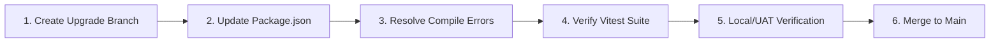

# Position Paper: React 19 Upgrade Strategy (Pre-Live vs. Post-Live)

This position paper evaluates the strategic trade-offs of upgrading the conformed frontend application (`@connectio/web`) from React 18 to React 19. It contrasts the immediate development cost against the long-term operational risks of performing this upgrade once the platform is live across active factory-floor operations.

---

## 1. Executive Summary

The platform is preparing for deployment across multiple manufacturing plants, serving 300+ lineside devices and dashboard panels. While the current hardening sprint prioritizes stability and data-pipeline accuracy, a core decision must be made regarding the React framework dependency:

* **The Thesis**: Upgrading core framework dependencies (React 18 to React 19) after go-live in a 24/7 manufacturing environment is a high-risk operation. Regressions in component rendering or state propagation can directly halt shift handovers, process staging, or quality inspections.
* **The Recommendation**: **Upgrade to React 19 now (pre-live).** The presence of modern development tooling (Vite 6, TypeScript 5.6.3, and TanStack React Query 5) minimizes the technical friction, and the pre-live environment provides a safe sandboxed window to absorb compilation failures and test breaks.

---

## 2. Strategic Options Comparison

### Option A: Upgrade to React 19 Now (Pre-Live)
*Upgrade the dependency stack in the active branch before starting integration/UAT testing.*

* **Pros**:
  * **Zero Operational Blast Radius**: Any rendering regressions, hook timing changes, or TypeScript compile errors are caught in local development or CI pipelines, before any operator relies on the system.
  * **Modern Framework Baseline**: Establishes a modern codebase baseline. This avoids "double migration" fatigue (developers writing React 18 patterns now, only to refactor them next quarter).
  * **Easier Testing**: Standard test suites (Vitest + Testing Library) can be updated and validated concurrently.
  * **Compiler Readiness**: Prepares the codebase for the **React Compiler (React Forget)**, which will automatically optimize heavy rendering loads (e.g. SPC Pareto charts and warehouse stock matrices) without manual `useMemo` overhead.
* **Cons**:
  * **Hardening Sprint Interruption**: Diverts developer attention for 1–2 days to resolve compile/test errors, rather than focusing purely on database/RLS bugs.

---

### Option B: Upgrade to React 19 Later (Post-Live)
*Freeze dependencies at React 18 for go-live, and defer the upgrade to a future maintenance window.*

* **Pros**:
  * **Sprint Integrity**: Maintains absolute focus on data contracts and query performance targets in the short term.
* **Cons**:
  * **High Production Risk**: Upgrading a foundational rendering library on live devices requires massive regression testing. A single unhandled component break could crash wallboards during active shifts.
  * **Shifting Rollouts**: Deploying framework changes to 300+ devices across multiple shifts requires complex rollback plans and support coverage.
  * **Accumulated Technical Debt**: Developers will continue writing React 18 patterns (such as `forwardRef` and manual memoization), creating more code that must eventually be refactored.
  * **Deprecation Debt**: Future third-party UI library updates will eventually drop React 18 support, forcing an upgrade under time pressure.

---

## 3. Technical Feasibility & Dependency Mapping

An inspection of [package.json](file:///home/timgeldard/github/connected-operations-intelligence/apps/web/package.json) shows that the project is well-positioned for an immediate upgrade. However, compatibility of developer tooling is a necessary but not sufficient condition for a successful upgrade. While the build and test tools support React 19, the application itself is currently on `react`/`react-dom` `^18.x`. React 19 introduces critical code-level behavioral and API changes (most notably the deprecation of `forwardRef` in favor of standard `ref` passing) that require manual code-level verification. Tooling compatibility does not guarantee that custom component rendering or state synchronization logic will work without regression.

The baseline version checklist for key dependencies is as follows:

* **Vite 6**: The build tool is already at version 6 (`"vite": "^6"`), which fully supports React 19.
* **TypeScript 5.6.3**: TypeScript is modern enough to support the new JSX and types definitions without version conflicts.
* **TanStack React Query v5**: Already in use. Minor versions of v5 officially support React 19, requiring no major query-layer migration.
* **React Testing Library**: RTL 16.x is already in use (`"@testing-library/react": "16.3.0"`), which was built specifically to support React 19's concurrent testing patterns.

### Next Steps Checklist for Verification:
* [ ] **Code Audit**: Audit all component signatures that use `forwardRef` to verify transition to React 19's direct `ref` prop.
* [ ] **Run the Full Test Suite**: Execute the full Vitest and React Testing Library suite to identify any concurrent rendering mismatches.
* [ ] **Audit Third-Party Components**: Verify that any external UI libraries are compatible with React 19.
* [ ] **Canary Rollout**: Perform a staged deployment starting with a single, low-risk test workspace before enabling it globally.

### Expected Code Adjustments:
1. **Ref Propagation**: Remove `forwardRef` boilerplate. In React 19, `ref` is passed as a standard prop.
2. **Context as Provider**: Replace `<MyContext.Provider>` with the new `<MyContext>` shorthand. Note that you must preserve the provider's `value` prop (e.g., `<MyContext value={someValue}>...</MyContext>`). Omitting the `value` prop will cause consumers to receive `undefined` or the default value configured in `createContext`. Any existing value expressions passed to `MyContext.Provider` must be preserved in the new shorthand form.
3. **Type Typings**: Resolve any strict TypeScript definition changes (e.g. `React.ReactNode` vs `React.JSX.Element` differences in custom component interfaces).

---

## 4. Implementation & Rollout Plan

If Option A is selected, the following migration path minimizes disruption:



### Step 1: Update Monorepo Dependencies
Run the package upgrade command in the workspace root:
```bash
pnpm update react@19 react-dom@19 @types/react@19 @types/react-dom@19 --recursive
```

### Step 2: Address Common Compilation Errors
* Search for any usage of `forwardRef` and simplify them to standard props.
* Resolve any strict type casting issues.

### Step 3: Run the Test Suite
Ensure the existing vitest suites pass:
```bash
pnpm --filter @connectio/web test
```

### Step 4: UI Smoke Tests
Perform visual verification on key pages (e.g. [RoleAwareHome.tsx](file:///home/timgeldard/github/connected-operations-intelligence/apps/web/src/pages/RoleAwareHome.tsx)) to ensure transitions, metrics, and modals load correctly.

---

## 5. Recommendation

We recommend proceeding with **Option A (Upgrade Now - Pre-Live)**. 

The immediate cost (estimated at 1-2 developer days) is significantly lower than the cost of a post-live upgrade, which would require extensive cross-browser QA, shift-coordinated deployments, and operational contingency planning. Doing it now establishes a robust, future-proof framework layer before the system enters the critical path of active factory-floor operations.
